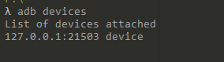

<!--
*** Thanks for checking out the Best-README-Template. If you have a suggestion
*** that would make this better, please fork the repo and create a pull request
*** or simply open an issue with the tag "enhancement".
*** Thanks again! Now go create something AMAZING! :D
***
***
***
*** To avoid retyping too much info. Do a search and replace for the following:
*** github_username, repo_name, twitter_handle, email, project_title, project_description
-->


<!-- PROJECT LOGO -->
<br />
<p align="center">
  <!-- <a href="https://github.com/github_username/repo_name">
    
  </a> -->

  <h3 align="center">China Post Auto Card Test Demo</h3>

  <p align="center">
    无风波浪狂，入夜分明见
    <br />
    
  </p>
</p>


<!-- TABLE OF CONTENTS -->
<details open="open">
  <summary><h2 style="display: inline-block">目录</h2></summary>
  <ol>
    <li><a href="#参考项目">参考项目</a></li>
    <li>
      <a href="#项目介绍">项目介绍</a>
      <ul>
        <li><a href="#built-with">Built With</a></li>
      </ul>
    </li>
    <li>
      <a href="#使用说明">使用说明</a>
      <ul>
        <li><a href="#准备工作">准备工作</a></li>
        <li><a href="#配置">配置</a></li>
        <li><a href="#运行">运行</a></li>
      </ul>
    </li>
    <li><a href="#license">License</a></li>
    <li><a href="#contact">Contact</a></li>
    
  </ol>
</details>

<!-- ACKNOWLEDGEMENTS -->
## 参考项目

* [DingDingAutoPlayCard](https://github.com/1414044032/DingDingAutoPlayCard)
* [TopSup](https://github.com/Skyexu/TopSup)
* [awesome-adb](https://github.com/mzlogin/awesome-adb)


<!-- ABOUT THE PROJECT -->
## 项目介绍


    本项目仅用于交流学习，请勿用于自动打卡什么的  


### Built With

* [Python](https://www.python.org/)
* [pyinstaller](http://www.pyinstaller.org/)


<!-- GETTING STARTED -->
## 使用说明

本项目依赖于android adb工具

### 准备工作

1. 安装 adb  
请到 [官网](https://developer.android.google.cn/studio/command-line/adb) 下载，并配置环境变量    
配置完成后输入以下命令检查：  
  

2. 安装 python3
[官网](https://www.python.org/)

  
    
      

### 配置
1. 下载代码
   ```sh
   git clone https://github.com/cyanot/CphrAutoCard.git
   ```
2. 安装依赖
   ```sh
   # 在程序根目录
   pip install -r requirements.txt
   ```
3. 配置  
配置文件是config目录下的 configure.conf  
3.1 百度OCR  
在[百度OCR平台](https://cloud.baidu.com/product/ocr)上创建应用申请 API Key 和 Secret Key  
    ```sh
    # 在配置文件中配置，ocr 普通识别文字接口 每天有 50000 次调用，
    # 但是只有2 rps，所以只能各用各的
    [baidu_api]
    APP_ID = 
    API_KEY = 
    SECRET_KEY = 
    ```
    如果是使用虚拟机，需要设置高精度识别，不然识别出来的班次信息会有所不对，在以下代码修改：
    ```bash
    # 代码目录：common/ocr.py 
    # line 302 可以自行选用 高精度识别还是普通识别
    # 高精度识别 日免费调用 500 次 额度
    response = client.basicAccurate(image_data)
    # 普通识别 日免费调用 50000 次 额度
    # response = client.basicGeneral(image_data)
    ```  

    3.2 邮箱SMTP设置
    ```sh
    [mail]
    # 发件人邮箱地址
    sender = 
    # 收件邮箱地址，自己使用这两个可以用同一个
    receiver = 
    # smtp 服务器地址，需要前往邮箱web版开通smtp发信功能
    host = 
    # smtp 端口
    port = 
    # 邮箱smtp登录用户名
    username = 
    # 注意此处的密码不是邮箱密码，而是开启smtp时候的授权码
    password = 
    ```  
      
    3.3  截图坐标配置
    先打开app，使用以下adb命令进行截图
    ```bash
    # 截图保存到 sdcard
    adb shell screencap -p sdcard/screenshot.png
    # 通过adb拷贝截图图片到电脑 . 是当前命令行运行目录
    adb pull sdcard/screenshot.png .
   ```
    然后根据以下配置文件说明进行配置
    ```sh
    [work]
    count = 2
    # 当天休息时候显示  今天休息的 长方形区域
    rest_region=35,230,1022,334
    # 休息时候的文字
    rest_text=今天休息
    # max 字段控制程序图像识别的时候会去截取几个长方形来识别班次
    # 办公班 max 为2 分别为上午班和下午班
    # 值班 会有第三个 夜班
    max = 3
    #
    #  windows自带的画图工具打开手机截屏图片
    #
    #  A----------------------B----------C----------D
    #  | 此处是班次1时间信息    |上班按钮  | 下班按钮  |
    #  E----------------------F----------G----------H 
    #  
    #  a----------------------b----------c----------d
    #  | 此处是班次2时间信息    |上班按钮  | 下班按钮  |
    #  e----------------------f----------g----------h 
    #  
    #  rect = left,top,width,height
    #  rect 是 长方形 ADEH 的信息 前两个字段是A点的位置信息
    #       left = A 点 x 坐标
    #       top = A 点 y 坐标
    #       width = AD 长度
    #       hegiht = AE 高度
    #  clearance 是两个班次之间的间隔 Ea 高度
    #  
    #  on_left 是 B 点的 x 坐标
    #  off_left 是 C 点的 x 坐标
    #  
    #  以上单位都是像素点
    rect = 34,248,1000,84
    clearance = 40
    on_left = 673
    off_left = 850
    # 这个针对的是 夜班第二天早上的签退，需要特殊处理
    # 这个字符用于ocr识别判断该班次是否是特殊班次
    special_text = 昨天
    # 以下两个配置项用于程序判断 识别出那些字符可以判定为 已上班/已下班
    work_on_end=已签到,迟到
    work_off_end=已签退,早退
    ```  
  
      
    应该能看懂吧？

    


### 运行

```sh
python play.py
```


<!-- LICENSE -->
## License

Distributed under the [BSD License](http://www.linfo.org/bsdlicense.html). See `LICENSE` for more information.


<!-- CONTACT -->
## Contact

不要联系我，自己看代码吧……


